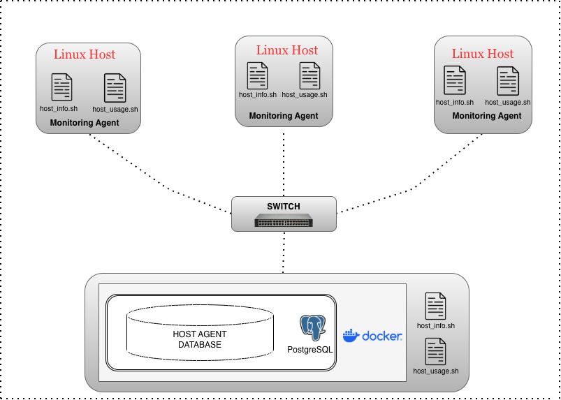

# Linux Cluster Monitoring Agent
# Introduction
The Linux Cluster Monitering Agent (LCA) is a software component installed on cluster nodes to collect both hardware specifications and resource usage data, to then store the data in a PostgreSQL database for analysis. The system is designed to for backend developers and LCA team members who need to monitor cluster health and performace over time. 

The monitoring agent consists of two main scripts:
- ```host_info.sh``` which captures static hardware specifications (executed once)
- ```host_usage.sh``` which collects dynamic resource usage data every minute

The solution uses **Docker** to provision a PostgreSQL instance, **Bash scripts** for data collection, and **crontab** for automated periodic data collections. To elaborate, all data is stored in a structured PostreSQL database, enabling historical analysis and cluster performance monitoring. The technologies used in this project include Docker, PostgreSQL, Bash, Git, and Linux system commands.

# Quick Start
1. Create/Start psql instance using psql_docker.sh
```bash
./scripts/psql_docker.sh create db_username db_password
./scripts/psql_docker.sh start
```
2. Create tables using ddl.sql
```bash
psql -h localhost -U postgres -d host_agent -f sql/ddl.sql
```
3. Insert hardware specifications data into the database using host_info.sh 
```bash
./scripts/host_info.sh psql_host psql_port db_name psql_username psql_password
```
4. Insert hardware usage data into the database using hsot_usage.sh
```bash
./scripts/host_usage.sh psql_host psql_port db_name psql_username psql_password
```
5. Crontab setup (collects data every minute)
```bash
crontab -e

#Add the following entry to collect usage data every minute
* * * * * bash /path/to/script/host_usage.sh psqlhost psql_port db_name psql_username psql_password &> /tmp/host_usage_$(date).log
```
# Implementation
## Architecture
The system consists of multiple Linux hosts that together form a cluster, where each host represents a node whose performance and resource usage needs to be monitored.



A centrilized PostgreSQL database runs within a Docker container on a local machine or server. This database acts as the core data store, collecting & organizing monitoring data from all nodes in the cluster. 

## Scripts
### ```psql_docker.sh```

Manages PostgreSQL Docker container lifecycle
```bash
#Create a new container
./scripts/psql_docker.sh create db_username db_password

#Start existing container
./scripts/psql_docker.sh start

#Stop running container
./scripts/psql_docker.sh stop
```
### ```host_info.sh```

Collects static hardware specifications
```bash
./scripts/host_info.sh psql_host psql_port db_name psql_username psql_password
```
### ```host_usage.sh```
Collects dynamic resource usage data
```bash
./scripts/host_usage.sh psql_host psql_port db_name psql_username psql_password
```
### ```crontab```
Since ```host_usage.sh``` captures dynamic resource usage data that undergoes continuous change, a ***crontab*** executes the command every minute to display current data.
- ```$(date).log``` --> creates a new file each run with an updated timestamp.
  ###### ```example of crontab entry:```  
```bash 
* * * * * /home/path/to/scripts/home_usage.sh psqlhost psql_port db_name db_password > /tmp/host_usage.log$(date).log
```
### ```queries.sql```
Helps to solve the business problem by understanding the state of the Linux cluster.

This file includes SQL queries used to analyze the collected monitoring data through:
- **Low-Memory Capacity Detection:** Reveals nodes operating with a memory capacity below the cluster capacity
- **Node Malfunction Detection:** Identifies servers that have missed the expected two-minute window, suggesting possible agent malfunctions, or system outages to trigger immediate operational review


## Database Modeling
### ```host_info.sh```
Gathers and stores hardware specifications on each node. Since these specifications are static, the script is executed only once.
| Column | Type | Description |
|----------|--------|--------|
| ```id``` | SERIAL | Primary key for each host |
| ```hostname``` | VARCHAR | Fully qualified host name |
| ```cpu_number``` | INT2 | Number of CPU's |
| ```cpu_architecture``` | VARCHAR | CPU architecture (ex. x86_64) |
| ```cpu_model``` | VARCHAR | CPU model name |
| ```cpu_mhz``` | FLOAT8 | CPU speed in MHz |
| ```l2_chache``` | INT4 | L2 cache size in KB |
| ```timestamp``` | TIMESTAMP | UTC time when hardware info was collected |
| ```total_mem``` | INT4 | Total system memory in KB |

### ```host_usage.sh```
Collects and records system resource usage every minute from each node. 
| Column | Type | Description |
|---|---|---|
| timestamp | TIMESTAMP | UTC time when usage data was collected |
| host_id | SERIAL | Foreign key referencing ```host_info.id``` |
| memory_free | INT4 | Free memory in MB |
| cpu_idle | INT2 | Percentage of CPU idle time |
| cpu_kernel | INT2 | Percentage of CPU time spent in kernel mode |
| disk_io | INT4 | Number of disk I/O operations |
| disk_available | INT4 | Available disk space in MB |

# Test
Testing was performed using the following approach:
1. ```psql_docker.sh```:
   - Tested all commands (create, start, stop) with various scenarios including creating existing containers, and stopping non-existent containers, to test successful and unsuccessul results.
3. ```ddl.sql```:
   - Executed against a live PostgreSQL instance
   - Verified tables were created successfully using ```\dt```
6. ```host_info.sh```:
   - Ran the scrip with valid and invalid parameters
   - Verified data insertion by querying the ```host_info``` table
   - Confirmed uniqueness constraint prevented duplicate hostname entries 
7. ```host_usage.sh```:
   - Executed the script and verified data appeared in ```host_usage``` table with correct foreign key references
   - Tested edge cases including high CPU load and low memory scenarios
8. ```crontab```: validated scheduled execution by confirming periodic inserts into ```host_usage```

All scripts passed testing and the data was successfully persisted to PostgreSQL.
# Improvements
**Three areas for future enhancements:**
1. **Add alerting functionality:** Integrate threshold-based alerting that triggers notifications when resource usage exeeds defined limits (e.g., CPU > 90%, memory_free <5%, disk_available <10%)
2. **Handle hardware updates:** Currently, ```host_info.sh``` only runs once. For environments where hardware can be dynamically added (e.g. cloud environments with auto-scaling), implement an UPSERT pattern or versioning system to track hardware changes over time.
3. **Implement data retention policy:** Add automated cleanup of old ```host_usage_``` data to prevent unbounded table growth. For organization purposes, implementing a partition by timestamp and schedule deletion of records older than 30 days or 90 days based on business requirements.

